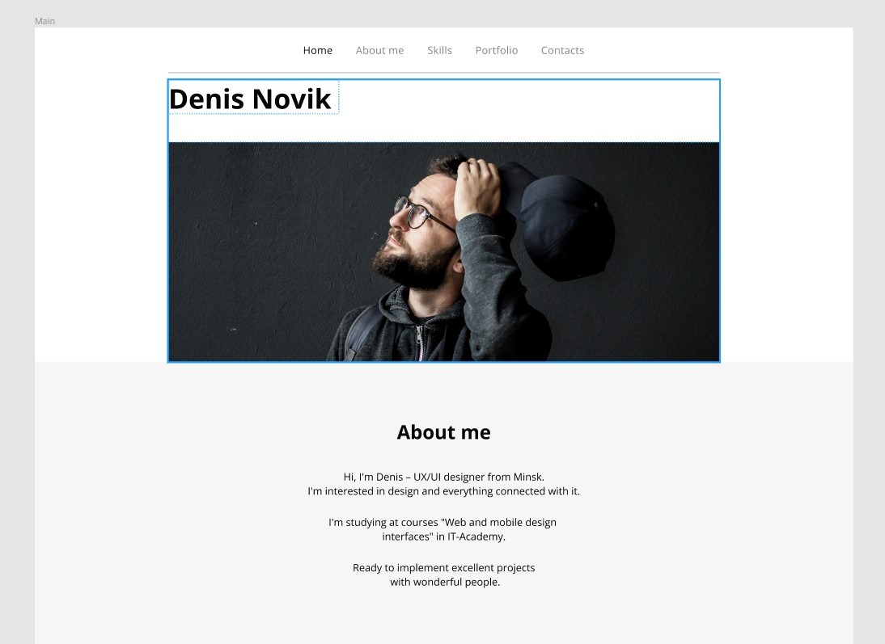

Експортувати усі малюнки з макету Denis Novik у папку image
Створити html структуру цього макету

Додай стилі до макету Denis Novik згідно з дизайном.
Не забудь підключити normalize.css або reset.css

